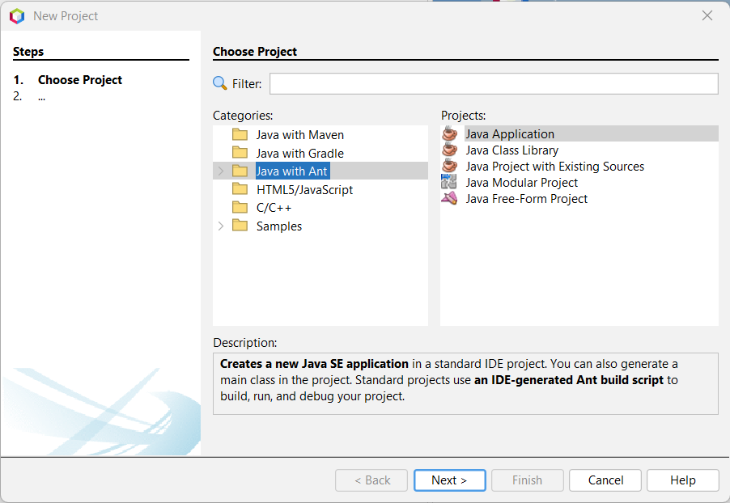
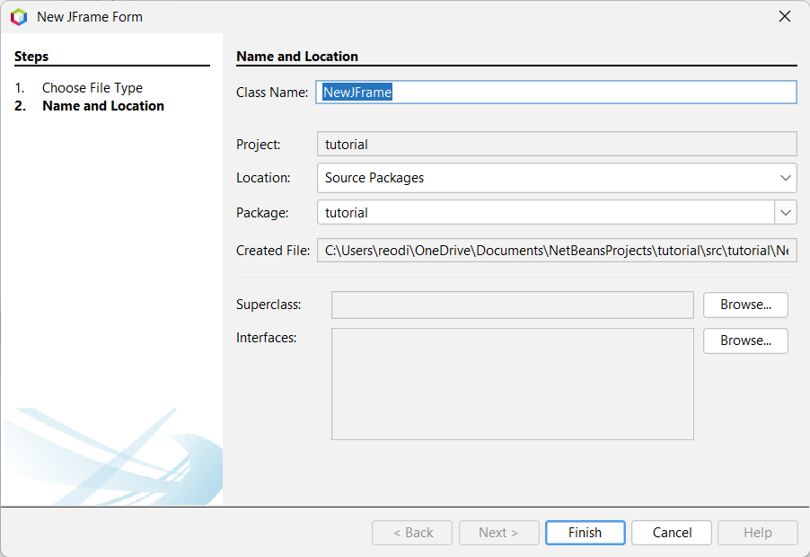

# Graphical User Interfaces (GUI)

Up until now, we have received and returned input and output through the console. While this is a valid way of doing so, it's quite ugly to look at when you think about it. I mean, who would want to look at a block of text in a black screen? Additionally, this current system of inputs and outputs is not-so-friendly to a casual person using programs. This is where a Graphical User Interface, or GUI for short, come in. Instead of a text-based interaction with the program, GUIs use visual representations to simplify and enhance the user experience.

GUIs are designed to make software and devices more user-friendly, and have become the standard interface for a wide range of applications, from operating systems to productivity software and games.

## Creating a Java GUI

For this section of the guide, we recommend using NetBeans (Apache NetBeans). Specifically, we will leverage NetBeans' JFrame Form Creation Tool to simplify our workload when creating GUIs.

Before we start, we need to create a new project in NetBeans.

::: tip
Most of you viewing this page should have already used the NetBeans IDE. If so, just create a new project and jump over [here](#creating-a-jframe-using-the-netbeans-ide). However, there are some people who have used their preferred text editor/IDE prior to this. If that is the case, or you would like to go over the steps of creating a NetBeans project, you can continue reading this section.
:::

### Creating a NetBeans Project

To create a NetBeans project, make sure you have NetBeans installed. If you don't, you can download the installer from [their page](https://netbeans.apache.org/front/main/download/)

Once you have NetBeans installed and running, click the "New Project" button on the top-left or use the keyboard shortcut `Ctrl + Shift + N` to create a new NetBeans Project.

After that, a popup box will appear. Make sure to pick **Java with Ant** as the **Category** and **Java Application** as the **Project**. Then, click **Next**.

The program will then ask you for the Project Name and some other information. Fill them however you see fit. 

::: warning
You must uncheck the **Create Main Class** option. If you created a project with this option active, delete the main class instead.
:::

Congratulations! You have created a new project in NetBeans. You should see this appear on the IDE.

### Creating a JFrame using the NetBeans IDE

Now that we have a NetBeans Project set up and ready to go, it is time we create the JFrame.

Navigate to your **Source Packages** and find the main package. For us, that is the `tutorial` package. 

Now, right-click the `tutorial` package. A drop-down menu should appear. Find **New**, then click **JFrame Form**.

The program will ask you to name your new `JFrame`. Name it accordingly, then click **Finish**.

Great! Now you should have your JFrame, ready to be edited.

## Adding GUI Components

If you have seen the right side of the Form Creator, you can see a "Palette" with a bunch of items. We won't go over all the items in here, we will only discuss the important ones from the `javax.swing` package.

### Basic Swing GUI Components

|    Component    |                                               Description                                                 |
|-----------------|-----------------------------------------------------------------------------------------------------------|
| JFrame          | A JFrame is the main window where the GUI is. Different components are added to this frame.               |
| JLabel          | A JLabel can be used as a text message, label, icon or image on the GUI. Does not emit events.            |
| JTextField      | A JTextField can be used to allow the user to input a single line of text, or for diplaying outputs.      |
| JButton         | A JButton is used in creating interactable buttons that can emit an event when it is clicked.             |
| JCheckBox       | A JCheckBox can be used as an on/off toggle. This is denoted as `true` and `false` inside code.           |
| JRadioButton    | A JRadioButton is used to select an option from a multitude of options.                                   |
| JTextArea       | A JTextArea can be used to allow the user to input multiple lines of text or for displaying long outputs. |
| JPanel          | A JPanel is used in storing a set of components inside a JFrame together.                                 |
| JPasswordField  | A JPasswordField is an input field where anything the user types is hidden with an `*` symbol.            |
| JList           | A JList displays a list of options and allows the user to select one or more items from it.               |
| JComboBox       | A JComboBox displays a popup menu with a list of options and allows the user to select one item from it.  |

### ButtonGroups

A `ButtonGroup` is a used to create a multiple-exclusion scope for a set of buttons. Basically, creating a set of buttons with the same `ButtonGroup` object means that turning "on" one of these buttons will turn all the other buttons in the group "off".

Normally, a `ButtonGroup` that can be used with any set of objects that inherit from `AbstractButton`. However, for simplicity's sake, we will only be using `ButtonGroup` with `JRadioButton`s.

Initially, all buttons in the group are unselected.

