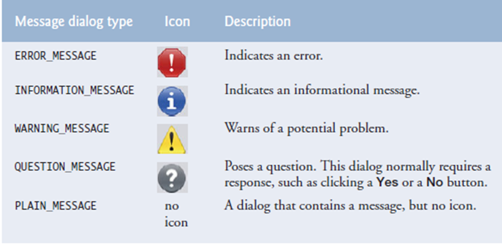

# Dialogs and Messages

There may be some instances where you wanted to show a quick message to the user, but it's too hard to be implemented into the GUI directly, or to be created in an entirely new JFrame. Luckily, there is a solution: the Dialog Box.

A dialog box can be used to easily display messages, output, or even take input! To use dialog boxes, you need the `JOptionPane` class from the `javax.swing` package.

## Taking input using a dialog box

To take user input using a dialog box, you can use the `JOptionPane.showInputDialog()` method.

```java
public static String JOptionPane.showInputDialog(Object message);
```

Using this method shows an input dialog with `message` as the message.


Additionally, you can center the input dialog relative to a component by providing a `parentComponent`.

```java
public static String JOptionPane.showInputDialog(Component parentComponent, Object message);
```

Using this method would center the created input dialog on the `parentComponent`.

Do you wanna add a title? Well, you can! 

```java
public static String showInputDialog(Component parentComponent, Object message, String title, int messageType);
```

This overloaded method shows a input dialog box from the user parented to `parentComponent` with the dialog having the title `title` and message type `messageType`.

- **Parameters:**
	- **parentComponent** the parent `Component` for the dialog
	- **message** the `Object` to display
	- **title** the `String` to display in the dialog title bar
	- **messageType** the type of message that is to be displayed: `JOptionPane.ERROR_MESSAGE`, `JOptionPane.INFORMATION_MESSAGE`, `JOptionPane.WARNING_MESSAGE`, `JOptionPane.QUESTION_MESSAGE`, or `JOptionPane.PLAIN_MESSAGE`.

While this dialog box is still on the screen, the user cannot interact with the application.

**Example:**
```java
String input = JOptionPane.showInputDialog(myJButton, "Please input a number.", "Number input", JOptionPane.QUESTION_MESSAGE);
```

## Displaying messages using a dialog box

To take user input using a dialog box, you can use the `JOptionPane.showMessageDialog()` method.

```java
public static void showMessageDialog(Component parentComponent, Object message);
```
Just like `showInputDialog()`, you can center the message dialog relative to a component by providing a `parentComponent`.

```java
public static void showMessageDialog(Component parentComponent, Object message, String title, int messageType);
```

This overloaded method brings up a dialog that displays a message using a default icon determined by the `messageType` parameter.

- Parameters:
	- **parentComponent** determines the `Frame` in which the dialog is displayed; if `null`, or if the `parentComponent` has no `Frame`, a default `Frame` is used.
	- **message** the `Object` to display.
	- **title** the title string for the dialog.
	- **messageType** the type of message that is to be displayed: `JOptionPane.ERROR_MESSAGE`, `JOptionPane.INFORMATION_MESSAGE`, `JOptionPane.WARNING_MESSAGE`, `JOptionPane.QUESTION_MESSAGE`, or `JOptionPane.PLAIN_MESSAGE`.

**Example:**
```java
String input = JOptionPane.showMessageDialog(myJButton, "Please input a proper number!", "Wrong input!", JOptionPane.ERROR_MESSAGE);
```

## Confirmations using a dialog box

To ask a user for confirmation using a dialog box, you can use the `JOptionPane.showConfirmDialog()` method.

```java
public static void showConfirmDialog(Component parentComponent, Object message);
```
Just like `showInputDialog()`, you can center the confirm dialog relative to a component by providing a `parentComponent`.

```java
public static void showConfirmDialog(Component parentComponent, Object message, String title, int optionType);
```

This overloaded method brings up a dialog where the number of choices is determined by the `optionType` parameter.

- Parameters:
	- **parentComponent** determines the `Frame` in which the dialog is displayed; if `null`, or if the `parentComponent` has no `Frame`, a default `Frame` is used.
	- **message** the `Object` to display.
	- **title** the title string for the dialog.
	- **optionType** the type of options available on the dialog: `JOptionPane.YES_NO_OPTION`, `JOptionPane.YES_NO_CANCEL_OPTION`, or `JOptionPane.OK_CANCEL_OPTION`.

If you want to add the `messageType` parameter as well, you can do so using the overloaded method below:

```java
public static void showMessageDialog(Component parentComponent, Object message, String title, int optionType, int messageType);
```

This overloaded method brings up a dialog where the number of choices is determined by the `optionType` parameter, where the `messageType` parameter determines the icon to display.

- Parameters:
	- **parentComponent** determines the `Frame` in which the dialog is displayed; if `null`, or if the `parentComponent` has no `Frame`, a default `Frame` is used.
	- **message** the `Object` to display.
	- **title** the title string for the dialog.
	- **optionType** the type of options available on the dialog: `JOptionPane.YES_NO_OPTION`, `JOptionPane.YES_NO_CANCEL_OPTION`, or `JOptionPane.OK_CANCEL_OPTION`.
	- **messageType** the type of message that is to be displayed: `JOptionPane.ERROR_MESSAGE`, `JOptionPane.INFORMATION_MESSAGE`, `JOptionPane.WARNING_MESSAGE`, `JOptionPane.QUESTION_MESSAGE`, or `JOptionPane.PLAIN_MESSAGE`.

`showMessageDialog()` outputs an integer that corresponds to the user's choice. You can compare the returned integer to the constants from the `JOptionPane`: `JOptionPane.OK_OPTION`, `JOptionPane.YES_OPTION`, `JOptionPane.NO_OPTION`, and `JOptionPane.CANCEL_OPTION`.

**Example:**
```java
int choice = JOptionPane.showConfirmDialog(myJButton, "Are you sure you want to confirm?", "Confirmation", JOptionPane.YES_NO_CANCEL_OPTION);

if (choice === JOptionPane.YES_OPTION) {
	// do something when the user clicks yes.
}

// ...
```

## Message types

For easy reference, refer to the image below for the types of `messageType` that you can use *taken from the presentation*.



Retrieved from *JOptionPane Message Dialog Constants.* (2019). In K. Sierra & B. Bates (Eds.), Java™ *How To Program (Early Objects)* (10th ed., p. 552). O'Reilly Media, Inc.: [https://www.oreilly.com/](https://www.oreilly.com/)